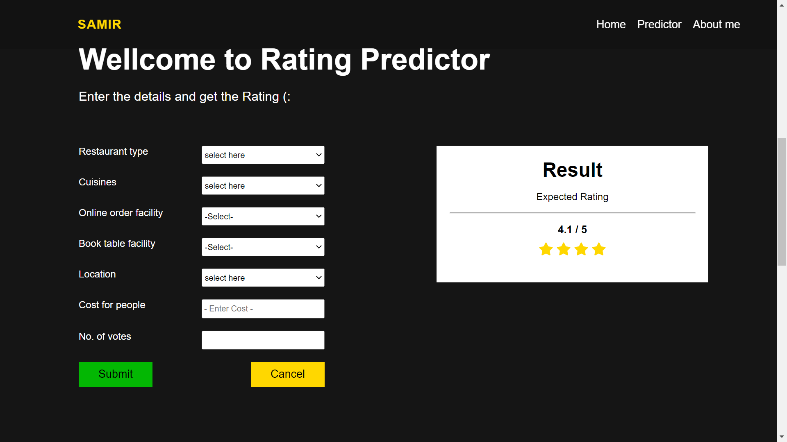

<h1> Restaurant Rating Prediction </h1>  
<h3>This project for the iNeuron Internship</h3>
  

  
<h2>Problem Statement</h2>
 

- The basic idea of analyzing the Zomato dataset is to get a fair idea about the factors affecting the aggregate rating of each restaurant, establishment of different types of restaurant at different places, Bengaluru being one such city has more than 12,000 restaurants with restaurants serving dishes from all over the world. With each day new restaurants opening the industry has'nt been saturated yet and the demand is increasing day by day. Inspite of increasing demand it however has become difficult for new restaurants to compete with established restaurants. Most of them serving the same food. Bengaluru being an IT capital of India. Most of the people here are dependent mainly on the restaurant food as they don't have time to cook for themselves. With such an overwhelming demand of restaurants it has therefore become important to study the demography of a location. What kind of a food is more popular in a locality. Do the entire locality loves vegetarian food. If yes then is that locality populated by a particular sect of people for eg. Jain, Marwaris, Gujaratis who are mostly vegetarian. These kind of analysis can be done using the data, by studying different factors.

## From all the Data available, we can bring out some neat insights or conclusions such as
- Which Restaurants has the highest number order ?
- How many Restaurants are accepting online orders?
- How many have a book table facility?
- Which location has the highest number orders?
- which restaurant has most common rating for orders ?
- What is the Average cost for 2 persons?
- How many types of Restaurant types are there?
- What is the most liked Dish type?

## What we used?  
We have used Python Libraries for data analysis and model creation (backend) and HTML, CSS and JavaScript for creating Web UI (frontend) for the project.

